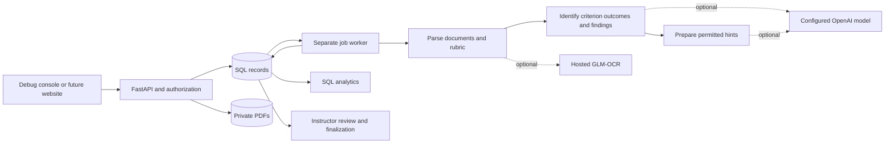

# Project guide

<!-- TODO: Replace the temporary Verity product name before launch. -->

Verity is the temporary name for Team Verity's HackCMU 2026 math-homework project.
The current implementation is an assessment API plus a deliberately plain debug
frontend. The primary use case is typed or handwritten discrete-math homework and
proofs: identify evidence-linked mistakes, issue constrained practice hints, and
let an instructor review and finalize a grade.

This guide describes the implemented MVP, including its limits. It is not a claim
of a deployed service or a complete course-management product. Keep it in sync
with code, [the API contract](docs/contracts.md), and [OpenAPI](backend/openapi.json).

## Quick start: no manual setup in the page

From `backend/`, install dependencies with `uv sync --frozen`, then run
`uv run python -m scripts.debug_server`. Open `http://localhost:3000/__debug__/`
and click **Run sample homework**. The launcher supplies fictional accounts,
PDFs, rubric and example grading. The page shows the mistake and hint; a separate
**Approve sample grade as teacher** button releases the example grade of 2/10.
No token entry, JSON editing, worker or AI credentials are needed.

This local-only launcher serves the console on port 3000 and an isolated API on
port 8001. It uses temporary records/files and disables external AI and S3. It
leaves the normal API/database on port 8000 alone. Stop a prior static server on
3000 first, or choose `--port` and `--api-port`. Ctrl+C cleans up the temporary demo.
The fixed sample illustrates the workflow; it does not claim to assess arbitrary
homework or perform AI grading. Raw controls remain under **Advanced**.

The launcher alone exposes same-origin `POST /__debug__/session` to supply demo
credentials in memory. It checks loopback Host, matching Origin and JSON content,
sets no-store, and is not part of the production API. Ordinary static hosting
still supports the advanced console, but cannot create a guided sample session.
PDF fixtures live under `frontend/output/pdf/`; `scripts.generate_samples` rebuilds
them using the ReportLab development dependency. `npm run test:guided` checks this
flow in a real browser, including cross-origin session rejection.

## 1. What exists

| Capability | Current implementation |
|---|---|
| Instructor materials | Private original PDFs for assignments, answer keys, rubrics and standards |
| Student work | PDF uploads, native text/character geometry, optional OCR, immutable submission revisions |
| Rubrics | JSON import, optional AI drafting, stable criterion/pattern IDs within each version, explicit publication |
| Grading | Shared manual/AI result records; code calculates points from selected rubric bands |
| Proof feedback | Evidence-linked findings, conceptual/procedural/execution classifications, approved hint ladders |
| AI review | Proposals remain review-required; an instructor must acknowledge review to finalize |
| Immediate hints | Can be issued before grade finalization; uncached AI/OCR still takes processing time |
| Annotations | Page-specific points in unrotated PDF space; manual placement and evidence-derived placement |
| Analytics | Distinct-student question/pattern aggregates, uncertainty coverage, version and attempt selection |
| Access | Global users, course memberships, staff/student projections, expiring local tokens or verified external JWTs |
| Processing | Durable database jobs, separate worker, idempotency keys, bounded retries and expiring claims |
| Debug frontend | Unlinked `/__debug__/` page: inputs, presets, request JSON, status and raw responses |
| Local operation | SQLite/private local files; optional Postgres Compose setup; no AI needed for manual grading |
| Deployment building blocks | Docker image, migrations, Postgres support and optional private S3 storage |

The debug page has no framework, styling system, dashboard, login screen or build
step. It is an API test console. Its unlinked URL is not an authorization boundary.
The API still validates every caller and record.

## 2. Repository map

```text
AGENTS.md                       branch, ownership and publication rules
PROJECT.md                      this project reference
README.md                       starting point
.env.example                    backend environment template; no secrets

docs/contracts.md               shared routes, shapes and workflow contract
frontend/
  index.html                    neutral root page; no debug navigation link
  __debug__/index.html          plain input/output form
  __debug__/app.mjs             DOM wiring, response display and resource IDs
  __debug__/api.mjs             HTTP requests, validation and job watching
  __debug__/presets.mjs         editable workflow examples
  __debug__/sample-rubric.json  sample induction rubric, matching backend example
  tests/                        unit tests and real-browser workflow fixture
  package.json                  development tests; no runtime dependencies
backend/
  verity/api.py                 FastAPI routes, permissions and response projections
  verity/schemas.py             validated request/model-output schemas
  verity/views.py               documented response schemas
  verity/models.py              SQLAlchemy tables
  verity/db.py                  engine, SQLite setup and request transactions
  verity/config.py              environment settings
  verity/auth.py                local bearer tokens and external JWT verification
  verity/access.py              resource ownership checks
  verity/pdf.py                 PDF validation, extraction, rendering and geometry
  verity/storage.py             private local/S3 document storage
  verity/grading.py             rubric validation, scoring, findings and audit
  verity/providers.py           OpenAI/GLM-OCR adapters and prompt versions
  verity/feedback.py            hint preparation, caching and issuance
  verity/jobs.py                durable job creation, claiming and processing
  verity/analytics.py           SQL coverage and distinct-student reports
  verity/math_checks.py         restricted polynomial identity checks
  verity/cli.py                 administrator-controlled user/token provisioning
  migrations/                  Alembic schema history
  examples/rubric.json          JSON import example
  scripts/demo.py               temporary, complete no-AI API demo
  scripts/export_openapi.py     schema export
  tests/                       backend behavioral tests
  Dockerfile, compose.yaml      API, worker, migration and local Postgres services
  pyproject.toml, uv.lock       Python dependencies and lockfile
  openapi.json                  generated frontend schema reference
ml/, infra/                     original placeholders; pipeline lives in backend/
```

## 3. Architecture

The application has three logical stages. Analytics reads their stored records;
it is not another model or evaluator.



**Parse:** preserve the original document, extract native text and geometry, retain
page images, optionally OCR handwriting, and establish an approved rubric.
Uploading a rubric PDF does not automatically make its criteria machine-readable.
Create structured criteria manually or generate a draft, then publish it explicitly.

**Identify:** assess every criterion, select approved bands, classify findings, and
reference real evidence regions. The model returns neither authoritative points
nor arbitrary pin coordinates. Python calculates points and derives geometry.
Alternative valid proofs are allowed; a reference solution is not the only method.

**Respond:** prepare/issue feedback separately from assessment. Changing a requested
hint level does not regrade the work. Approved text is the default; optional generated
text receives a limited teaching brief, not the private answer-key PDFs or full staff
rationale. There is no independent reviewer-model loop.

## 4. Start locally

### Prerequisites

- Python 3.12 or newer and `uv` for the backend.
- A browser. The debug frontend itself only needs Python's static HTTP server.
- Node/npm and installed Google Chrome only if running frontend automated tests.
- Docker is optional for the local Postgres/API/worker setup.
- OpenAI and Z.ai credentials are optional; the manual workflow uses neither.

### Backend, identities and frontend

From the repository root, copy `.env.example` to `.env` once. Do not overwrite an
existing configured `.env` when repeating setup. Then:

```bash
cd backend
uv sync --frozen
uv run python -m alembic upgrade head
uv run python -m verity.cli teacher@example.test --name "Instructor" --role instructor
uv run python -m verity.cli student@example.test --name "Student" --role student
uv run python -m uvicorn verity.api:app --reload --port 8000
```

Each provisioning command returns a user ID and bearer token. Tokens expire after
24 hours by default; `--token-hours` accepts 1–168 hours. Repeating the command for
the same identity/role issues another token. Roles or external subjects cannot be
changed implicitly by rerunning it with different values. The CLI requires local
database access and is not a public signup endpoint.

In a second terminal, run the worker from `backend/` if testing AI:

```bash
uv run python -m verity.jobs
```

In a third terminal, from the repository root:

```bash
python3 -m http.server 3000 --bind 127.0.0.1 --directory frontend
```

Open **http://localhost:3000/__debug__/**. Paste the two tokens and leave the API
origin at `http://localhost:8000`. Use the selected identity for each request.
Default CORS permits `http://localhost:3000`; if you instead open the page through
`127.0.0.1`, add that exact origin to `CORS_ORIGINS` and restart the API.

Useful backend paths:

| Path | Purpose |
|---|---|
| `/health/live` | Process liveness |
| `/health/ready` | Database/schema readiness |
| `/docs` | Interactive OpenAPI documentation |
| `/openapi.json` | Machine-readable API schema |
| `/api/v1/...` | Authenticated application endpoints |

The frontend is a separate static server. The API does not mount `/__debug__/`.
For a future website, host `frontend/__debug__/` at that path and omit a navigation
link. Its relative assets work without bundling. Configure the API origin and CORS
for the destination environment. `noindex` metadata discourages indexing but does
not grant or restrict access.

### Optional local containers

After creating the root `.env`, run from the repository root:

```bash
docker compose -f backend/compose.yaml up --build
```

Compose starts Postgres, runs migrations, then starts the API and worker. The API
binds to localhost:8000. Documents and database state use named volumes. The included
database password is for this local development network; Postgres has no host port.
Provision users inside the API container with `docker compose -f backend/compose.yaml
exec api python -m verity.cli ...`. Run the static frontend separately as above.

## 5. Debug console workflow

Every preset only fills inputs. **Send request** performs the selected operation.
The method/path/body remain editable. The Resource IDs section captures IDs from
successful responses and lets you supply IDs from existing records. After changing
IDs, reload the preset to rebuild the request. Lists do not automatically select
one record on your behalf.

### Manual end-to-end example

1. Select Student and send **Who am I?** to capture the student user ID.
2. Select Staff, send **Create course**, then **Enroll student**.
3. Choose a PDF and send **Upload PDF answer key** as staff. Its ID is retained
   separately from the current document ID.
4. Send **Create assignment (manual)**. Review its question and material IDs first.
   The preset uses the induction problem matched by the sample rubric.
5. Send **Import rubric JSON**, inspect/edit its criteria and hint ladder, then
   **Publish rubric**. Once published, that version cannot be edited.
6. Select Student, choose the homework PDF, send **Upload homework PDF**, then
   **Read PDF geometry / regions** and **Register submission**.
7. Select Staff and send **Create manual assessment**. Change the sample selected
   bands to match the actual work. A successful job response contains the assessment ID.
8. Send **Add manual finding** with the correct diagnosis and evidence region ID.
   The example finding is for circular induction; it is not an automatic diagnosis.
9. Select Student and send **Request approved hints**. These are available while
   the grade is still review-required. Requesting level 4 does not bypass a level-2 cap.
10. Select Staff, send **Read assessment** to obtain its current version, make any
    corrections, then send **Finalize reviewed grade** when satisfied.
11. Select Student and read the assessment again. Its numerical score is now visible
    if the assignment allows score display. Staff can also inspect analytics.

For arbitrary assignments, replace the sample prompts, criterion IDs, bands,
patterns and hints with your own structured specification. The console's examples
are not a parser for arbitrary uploaded answer keys.

### AI workflow

Create an AI-enabled assignment and configure server credentials/permission switches
as described below. Optionally set `ocr_enabled: true` for handwriting OCR. Import
and publish a rubric, or generate a draft and inspect it before publication. Then
upload/register homework and send **Create AI assessment**.

Use **Watch job** to poll its status. Successful completion captures the assessment
ID. Read the assessment as staff; request approved/AI hints as the student. If an
uncached AI hint request returns a job, watch it and then read feedback history.
A worker must be running. AI feedback can precede grade review; final scores cannot.

**Stop waiting** stops browser polling or the current browser request. It does not
cancel a job already created on the server. **Retry failed job** is a separate,
explicit mutation and is subject to the backend's retry limit.

### Raw inputs and outputs

The console sends only to the selected HTTP(S) API origin and supported API paths.
It does not follow redirects with bearer credentials. JSON is validated before
sending; multipart uploads use a `file` field and browser-generated content boundary.
Response JSON and text use text rendering, not HTML injection. Binary PDFs get a
download link and PNGs get an image preview. Token fields are password inputs;
tokens are not put in browser storage, cookies or response/request summaries.

The console includes no automatic grade approval, database reset, bulk deletion,
provider-key editor, or public-login flow. All normal API permissions still apply.

## 6. Identity and access rules

| Identity | Permissions |
|---|---|
| Global admin | Provision users and operate as an instructor across courses |
| Global instructor | Create a course; access other courses only through membership |
| Course instructor | Manage course members/assignments/rubrics, grade and finalize |
| Course TA | Access staff grading records and edit grading; cannot finalize or confirm as instructor |
| Course student | Access own work and issued feedback; finalized scores when enabled |

Local bearer tokens are random values; only SHA-256 digests and expiry are stored.
There is no insecure role header. For external login, configure issuer, audience and
HTTPS JWKS URL together. The API verifies RS256 signature, expiry and claims; `sub`
must match a provisioned user's external subject. Course roles still come from the
database. The repository does not implement a hosted OAuth login/signup screen.

Student projections omit private rubric internals, answer keys, staff rationale,
AI proposals, findings and provisional scores. Inaccessible resources usually return
404; authorized users attempting a forbidden operation receive 403. PDF originals
and preview images require authorization. S3 documents are not public URLs.

## 7. Records, versions and scoring

| Record | Responsibility |
|---|---|
| User / Token / Membership | Identity, expiring local access, course-specific roles |
| Course / Assignment | Course ownership, questions, materials and feedback policy |
| Document | Private original bytes, hash, type, page geometry and OCR state |
| Region | Text/image evidence geometry, source and confidence; native characters or steps |
| Rubric | Version number, immutable published specification and provenance |
| Submission | Student, assignment, document revision and pinned question-region mapping |
| Assessment | Pinned submission/rubric, source, proposal, review state, score and edit version |
| CriterionResult | One status/band/outcome per criterion |
| Finding | Evidence, approved pattern, category, impact, anchor, optional root cause and confirmation |
| Hint | Cached text for a finding version, source and permitted level |
| IssuedFeedback | Immutable snapshot of feedback that was issued |
| Job | Actor, request hash/key, type, status, attempts, lease and result ID |
| AuditEvent | Creation/edit/review history, including previous staff-visible values |
| MathCheck | Bounded polynomial check and its scope; never proof-wide verification |

Each submitted PDF can be registered only once; a new upload creates a new revision.
Rubric version changes do not silently regrade existing work. Create another
assessment with the desired published version. Assignment policy and materials are
immutable through the current API; changing them requires a new assignment.

A rubric defines stable criterion IDs, question IDs, requirements, maximum points,
fixed-point performance bands, concept IDs and source references. Approved error
patterns specify their eligible criteria, concept, category, definition, exclusions
and hint ladder. Patterns cannot silently change taxonomy during assessment.

An outcome is `assessed`, `uncertain` or `not_applicable`. Assessed outcomes select
an existing band; the backend adds its points. The maximum is bounded by the
criterion's published bands. Uncertain results have no score and block finalization.
This MVP does not implement arbitrary scoring dependencies, carry-through caps or
an executable grading-rule language.

Findings use conceptual, procedural, execution, notation, incomplete or uncertain
categories. Impact is separate: local, propagated or solution-invalidating.
A root-cause reference links downstream consequences without implying that a large
impact establishes a conceptual misunderstanding. Instructors may edit, dismiss,
confirm or reposition findings. An unlocalized finding is `pending_anchor`.

Edit requests use `expected_version`. Stale writes return 409. Finalization requires
an instructor, current version and `acknowledge_review: true`; uncertain outcomes
and unresolved findings must be corrected or dismissed first. Finalized assessments
are immutable. Original proposals and audit events retain prior versions of judgments.

## 8. PDF and OCR geometry

Default upload bounds are 10 pages and 20 MiB. PDFs must be unencrypted and readable;
unsupported page dimensions or excessive text are rejected. Original bytes are
preserved. Filenames and document content are not trusted as storage paths.

Canonical coordinates are unrotated PyMuPDF page space, in points. An anchor contains
`document_revision_id`, zero-based `page_index`, `x`, `y`, `units: pt`, coordinate
space, relationship and target granularity. A point alone without a document/page
identity is insufficient.

Page metadata includes crop box, original rotation, rotation/derotation matrices,
render scale, and page-to-image/inverse transforms. Preview PNGs are unrotated and
rendered at 1.5×. Native text retains step and character geometry. GLM-OCR retains provider
boxes and transforms with unknown confidence. Its block anchors use the existing
step-level API and do not provide precise symbol localization.
The model chooses evidence IDs; code computes the pin from their geometry.

For several questions, staff must map each question before AI assessment. Manual
boxes can represent scanned answers without transcription. Once assessment creation
begins, the region map is pinned. PostgreSQL row locks serialize mapping changes
against job creation. Evidence from another document or mapped question is rejected.

Hosted GLM-OCR receives one unrotated PNG per page via a private base64 request.
`GLM_OCR_BBOX_FORMAT=pixels` follows the live hosted response verified on
2026-09-12; returned page dimensions are required. The API reference instead
describes 0–1 coordinates; `normalized` remains available for that convention. The adapter never
guesses units. Invalid boxes, reported rotations and aspect-ratio changes fail the
job rather than placing misleading pins. Actual PNG dimensions and the saved
inverse transform account for rendering roundoff, crop boxes and PDF rotation.
Provider token counts are retained in region evidence (repeated per block: do not
sum blocks to estimate billing). Crop images and visualizations are disabled.
No provider zero-retention guarantee is implied. A native-text page
may still contain handwriting, so OCR is an explicit assignment setting, not inferred
from whether any selectable text exists. No claim of perfect handwriting recognition
or automatic symbol targeting is made.

## 9. Hint policy and disclosure

| Level | Intended maximum disclosure |
|---|---|
| 0 | Location to reconsider |
| 1 | Concept cue |
| 2 | Next thinking step without completing the repair |
| 3 | Local correction |
| 4 | Worked solution where permitted and supported |

Effective level is `min(requested, max_disclosure_level, release_level)`.
Other independent settings are `location_visibility` (point/question/hidden),
`max_findings`, `max_words`, `allow_generated` and `show_scores`.
The server enforces these settings; a client cannot override them through its request.

Approved pattern hints or a short generic template are available without AI.
Generated hints are optional and advisory: structural checks cannot guarantee semantic
nondisclosure of free-form text. Use approved hints for strict assignments. Repeated
requests reuse cached text for the same finding version/level/source. Instructor
edits invalidate that cache through versioning. Already-issued text remains in history.
Issuance is recorded; reading, understanding, or causal learning improvement is not inferred.

## 10. Jobs, retries and analytics

Assessment creation, AI rubric drafting and feedback issuance use `Idempotency-Key`.
Same actor/key/body returns the existing operation; a different body with the same
key returns 409. Distinct keys can intentionally create distinct assessments.
Normal manual assessment and cached/bank feedback complete during the API request;
external processing runs in the separate worker.

Job states are queued → running → succeeded/failed. The worker atomically claims a
queued job. Results and success commit in the same transaction. A crashed claim
expires after 30 minutes; a failed job can be explicitly retried up to three attempts.
Safe error codes do not include provider response bodies or student content.
There is no job-cancel endpoint, scheduler service, streaming inference response or
Redis dependency. The MVP processes questions serially; Postgres permits multiple
worker processes. SQLite is for a single-host development setup.

Analytics require one published rubric version. `latest_assessed` selects each
student's newest assessed revision at that version; `first_submitted` selects the
first revision and its newest assessment at that version. No report blends rubric
versions. Distinct students, not pins, form numerator/denominator counts. Dismissed
findings are excluded. Uncertain work is reported separately from completed applicable
assessment. Instructor-confirmed counts are a subset of flags, not an extra total.
Reports include attempt policy, rubric/taxonomy version and `as_of`.

Question reports provide submitted/completed/uncertain/not-applicable/unassessed
counts and conceptual-flag rates. Pattern reports group by approved concept and
pattern. Multi-attempt persistence reports, learning-effect claims and AI-written
analytics summaries are not implemented.

## 11. Configuration reference

The backend reads environment variables and root/local `.env` files through Pydantic
settings. Frontend connection values are page inputs, not environment secrets.

| Variable | Purpose / default |
|---|---|
| `DATABASE_URL` | `sqlite:///./data/verity.db`; deployment uses `postgresql+psycopg://...` |
| `STORAGE_DIR` | `./data/documents` for private local PDFs |
| `S3_BUCKET` | Empty by default; enables private S3 storage when set |
| `S3_REGION` | `us-east-1` |
| `S3_ENDPOINT_URL` | Optional S3-compatible endpoint |
| `AWS_ACCESS_KEY_ID`, `AWS_SECRET_ACCESS_KEY` | Optional credentials; SDK credential chain/workload identity also supported |
| `CORS_ORIGINS` | JSON array; `["http://localhost:3000"]` |
| `EXTERNAL_AI_ENABLED` | Global external-call switch; `false` |
| `OPENAI_API_KEY` | Server-only API key; empty by default |
| `OPENAI_MODEL` | Configured Responses model; default `gpt-6-astra` |
| `OPENAI_REASONING_EFFORT` | `high` |
| `ZAI_API_KEY` | Optional hosted GLM-OCR credential |
| `GLM_OCR_BBOX_FORMAT` | `pixels` (default) or `normalized`; see geometry notes |
| `JWT_ISSUER`, `JWT_AUDIENCE`, `JWT_JWKS_URL` | Configure together for verified external RS256 tokens |
| `LOCAL_TOKENS_ENABLED` | `true`; disable only after external auth is configured |
| `MAX_PDF_PAGES` | `10` |
| `MAX_UPLOAD_BYTES` | `20971520` (20 MiB) |
| `WORKER_POLL_SECONDS` | `2` |

To enable AI, set the global switch and OpenAI credential, choose a compatible model
available to the account, and enable the assignment's `external_ai_allowed`. OCR
also requires `ZAI_API_KEY` and `ocr_enabled: true`. It uses the hosted
[Z.ai layout API](https://docs.z.ai/api-reference/tools/layout-parsing), with no
local model or GPU dependency. Restart the API and worker after changing settings.
Completed OCR is reused, including historical provider evidence; old assessments
are not rewritten. Failed jobs can be explicitly retried and may incur new charges.
There is no automatic OCR retry or paid-provider fallback. Generated hints additionally require
`feedback_policy.allow_generated`. These permissions are independent.

The configured OpenAI adapter uses Responses structured output, image input, bounded
timeouts/retries, prompt-version provenance and `store: false`. Provider availability,
account access, pricing and retention are external concerns; this repository does
not promise that every account can use its default model or that `store: false`
means zero retention. Never put provider credentials into frontend tokens or commits.

## 12. API route reference

All application paths below are relative to `/api/v1`. Requests/responses and exact
validation constraints are defined in [OpenAPI](backend/openapi.json).

| Methods | Path | Purpose |
|---|---|---|
| GET | `/me` | Current identity and course memberships |
| POST | `/users` | Admin-controlled user provisioning |
| GET, POST | `/courses` | Accessible courses / create course |
| POST | `/courses/{id}/members` | Enroll an existing user |
| GET, POST | `/courses/{id}/assignments` | List/create assignments |
| GET | `/assignments/{id}` | Assignment and published-rubric IDs |
| POST | `/documents` | Multipart PDF upload with course and kind query parameters |
| GET | `/documents/{id}` | Page geometry and paginated source regions |
| GET | `/documents/{id}/file` | Authorized original bytes |
| GET | `/documents/{id}/pages/{index}/image` | Authorized page PNG |
| POST | `/assignments/{id}/rubric-versions` | JSON rubric draft |
| POST | `/assignments/{id}/rubric-drafts:generate` | AI draft job |
| GET | `/rubric-versions/{id}` | Staff-visible rubric specification |
| POST | `/rubric-versions/{id}:publish` | Publish selected draft |
| GET, POST | `/assignments/{id}/submissions` | Authorized list/new revision |
| GET | `/submissions/{id}` | Submission and assessment IDs |
| PUT | `/submissions/{id}/regions` | Staff question/evidence mapping before processing |
| POST | `/submissions/{id}/assessments` | Manual outcomes or AI assessment job |
| GET | `/assessments/{id}` | Role-filtered assessment |
| PUT | `/assessments/{id}/results` | Replace complete criterion outcomes |
| POST | `/assessments/{id}/findings` | Manual finding |
| PATCH | `/findings/{id}` | Full finding edit/dismissal with expected version |
| POST | `/assessments/{id}:finalize` | Instructor review acknowledgment and final grade |
| POST | `/assessments/{id}/feedback` | Issue manual, approved or generated feedback |
| GET | `/submissions/{id}/feedback` | Issued-feedback history |
| POST | `/assessments/{id}/math-checks` | Bounded rational polynomial identity check |
| GET | `/jobs/{id}` | Authorized status and safe result/error |
| POST | `/jobs/{id}:retry` | Explicit failed-job retry |
| GET | `/assignments/{id}/analytics/questions` | Coverage/conceptual aggregates |
| GET | `/assignments/{id}/analytics/patterns` | Approved pattern aggregates |

No arbitrary Python/SymPy expression evaluation is exposed. The math-check endpoint
uses an AST whitelist, bounded degree/size and explicitly constructed expressions.
It can return equivalent, not-equivalent or unsupported. It does not verify a proof,
make the entire assessment verified, or change a grade.

## 13. Testing and troubleshooting

Backend checks, from `backend/`:

```bash
uv run python -m pytest -q
uv run ruff check verity tests scripts migrations
uv run python -m alembic check
uv run python -m scripts.demo
uv run python -m scripts.export_openapi
```

Frontend checks, from `frontend/`:

```bash
npm ci
npm test
npm run test:browser
```

The browser smoke test uses installed Chrome, a temporary backend database, fresh
identities and a synthetic PDF. It checks the actual input/output workflow, hidden
proposed scores, capped hints, finalization, retries, binary output, errors and token
clearing. It does not call external AI. Backend provider tests mock request/response
adapters; they are not a mathematical-quality evaluation of live model judgments.

| Symptom | What to check |
|---|---|
| Browser network error | API running, correct origin, exact CORS origin; HTTPS frontend cannot call an HTTP backend |
| 401 | Missing/expired token, wrong local-token configuration, or invalid JWT issuer/audience/signature |
| 403 | Active identity lacks the required course role or feature permission |
| 404 on an existing record | Wrong course/student ownership or staff-only resource; hidden resources deliberately return 404 |
| 409 | Stale edit version, reused key with changed request, immutable finalized/evidence state, or exhausted/invalid retry |
| 413 | PDF exceeds configured upload bytes |
| 422 | Invalid PDF/schema, unknown IDs/bands, missing criterion coverage, invalid anchor or missing question mapping |
| 503 `external_ai_disabled` | Both global and assignment AI switches must permit the operation |
| `openai_not_configured` / `glm_ocr_not_configured` | Missing required server credentials |
| Job stays queued | Start the separate worker against the same database/environment |
| `worker_lease_expired` | Worker stopped or exceeded its claim; inspect service state, then explicitly retry |
| `model_request_failed` / `ocr_request_failed` | Provider credentials/access, request compatibility, connectivity, limits or timeout |
| `ocr_invalid_geometry` | Check the configured box format against the actual provider response; inconsistent geometry is rejected |
| `ocr_invalid_response` / `ocr_image_too_large` | Missing usable layout or rendered page above the 10 MiB provider limit |
| `pending_anchor` | Supply a valid manual point/evidence or dismiss after review; no precise location was established |
| Blank student score field | Proposal not finalized, score display disabled, or uncertain assessment |
| Finalization fails after a finding edit | Read the assessment again and use its updated version |
| Server readiness fails | Database reachable and Alembic migrations applied |

Keep student content and credentials out of logs. Error codes intentionally omit
raw provider bodies. Do not assume a failed browser response means a mutation did
not happen; retry with the same idempotency key or inspect the relevant records.

## 14. Deployment, collaboration and current limits

A hosted installation needs an API service, separate worker, migrated Postgres,
private storage, configured authentication, explicit CORS and an HTTPS frontend.
Use the provided Dockerfile as the backend image. The Compose configuration is for
local development. No cloud account, paid hosting or public website is provisioned
by the repository. Configure/verify backup, retention/deletion, service monitoring
and rate limiting before a real class deployment.

Work on `agent/<area>/<task>` branches. Commit and push task changes before handoff.
Do not edit/merge `main` directly. Shared contracts precede code and reach integration
through a PR; the integrator merges. Check `AGENTS.md` for current ownership. A frontend
PR may temporarily target the backend branch while that dependency awaits merge;
retarget it to `main` after integration. Never commit `.env`, tokens, private PDFs or
unrelated user work.

Deliberately outside this MVP: full production course management, LMS synchronization,
programming autograders, online quiz authoring, bubble sheets, group submissions,
deadlines/late penalties, extensions, regrade conversations, bulk scan splitting,
automatic question segmentation, arbitrary proof verification, advanced scoring
rules, model-based analytics summaries and a polished student/instructor application.
Live handwriting accuracy, feedback quality and grading quality require evaluation
with instructor-approved examples. The current debug console is for testing those
workflows, not a production student interface.
